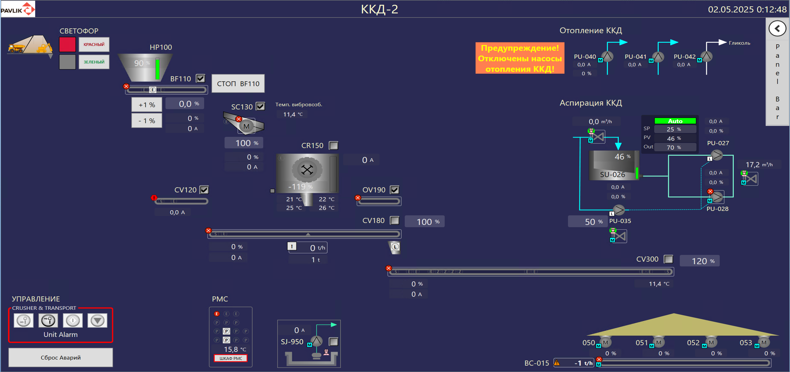

# АСУ корпуса крупного дробления (ККД)

   

## Описание проекта

Система автоматизации корпуса крупного дробления на базе Siemens S7-1500 в TIA Portal v16. Управление технологическим процессом дробления горной массы, включая контроль и мониторинг оборудования.

## Технические характеристики

- Контроллер: Siemens S7-1500
- Среда разработки: TIA Portal V16
- Протоколы связи: PROFINET
- Количество сигналов ввода/вывода: 126
- SCADA-система: FLS ECS

## Оборудование

### Конвейерные линии

- CV300, CV180, CV120 (с частотно-регулируемым приводом INVT GOODRIVE)
- Магнит OV190

### Дробильное оборудование

- Питатель BF110, Грохот SC130 (с частотно-регулируемым приводом Schneider Altivar ATV)
- Щековая дробилка CR150

### Аспирация и отопление

- 6 насосов
- 2 задвижки
- Ультразвуковой уровнемер
- PID регулятор уровня в баке
